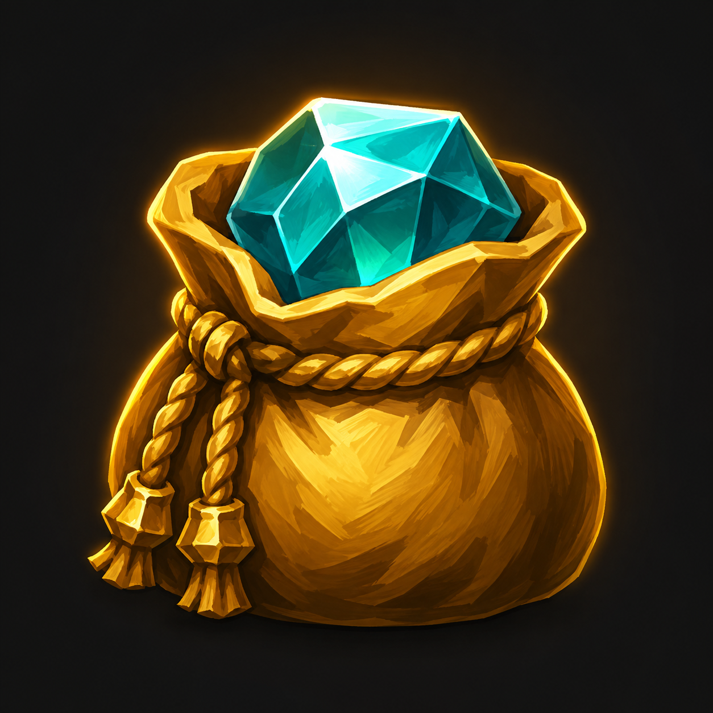

# What To Buy

Small WoW Retail shopping helper for enchants, gems and consumables. Open `/wtb`, the addon menu beside the minimap, or the button above the auction house. Browse without an auction house; searching requires one. Items are grouped into collapsible sections with a scrollbar. Select Mythic+ or Raid, then search an item. Auto uses Auctionator when available; WoW uses the default auction house. English and Russian UI.

Temporary Archon.gg shopping data is copied from the author's PopularSlotsAndChants addon, dated 2026-08-29. No dependency on that addon. Purchase confirmation stays in the auction house.

- Setup: `python -m pip install -r scripts/requirements.txt`.
- Deploy: `python scripts/deploy.py` (defaults to the local F: WoW installation). Override with `--wow-root` or `WOW_RETAIL_PATH`; add `--watch` for automatic deployment.
- Validate: `python scripts/validate.py`.
- Package: `python scripts/package.py`.
- Replace data: `python scripts/import_data.py PATH_TO_DATA.lua`.

The draggable minimap button opens the list anywhere and remembers its position. LibDataBroker and LibDBIcon are bundled; no other addon is required.

Click the specialization name in the header to shop for another specialization of your class. Every time the window opens, it defaults to your active specialization. The selection is not saved and does not change your character's specialization.

Runtime: `Core.lua`, `Shopping.lua`, `Minimap.lua`, `Locales.lua`, `Data.lua`, `Media/Icon.tga`, `Libs/`.

CI validates and packages. Tags `vX.Y.Z` must match the TOC version. CurseForge placeholder: set repository variable `CF_PROJECT_ID` and secret `CF_API_KEY` to enable publishing through BigWigs Packager. No remote or public release is configured yet.
